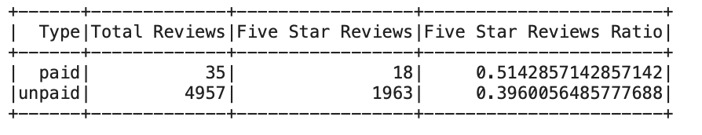

# Amazon Vine Analysis

## Overview of the project

The purpose of this project is to determine if customers participating in Amazon Vine program are more likely to leave favourable reviews. 

The Amazon Vine program is a service that allows manufacturers and publishers to receive reviews for their products. Companies pay a small fee to Amazon and provide products to Amazon Vine members, who are then required to publish a review.

### Project

1. Perform the ETL process to extract the reviews for Major Home Appliances from Amazon repository, transform the data, connect to an AWS RDS instance, and load the transformed data into pgAdmin using PySpark for further analysis.

2. Perform analysis to determine if there is any bias toward favorable reviews from Vine members in the dataset. 

## Results

After extracting and analysing the data we can see that:

1. There are 35 paid and 4957 unpaid reviews for Major appliances that have received 20 or more helpful votes.

2. Out of them, there are 18 paid 5-star reviews and 1963 unpaid 5-star reviews.

3. 5-star reviews make up 51% of paid reviews and only 40% of unpaid reviews.

## Summary

At first glance it appears that there might be a positivity bias for reviews in the Vine program because products participating in the Vine program receive 51% of 5-star reviews as opposed to 40% for products that are not a part of the Vine program. 

To confirm that these results are significant we would need to conduct statistical analysis to confirm that the difference in percentages is due to the Vine program. 

Also, I think it would be interesting to look at the average scores received by products in the Vine program vs those not in the Vine program.
